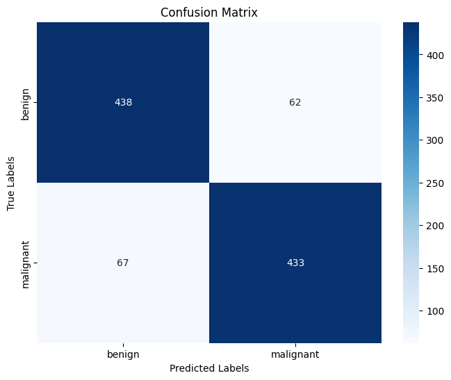
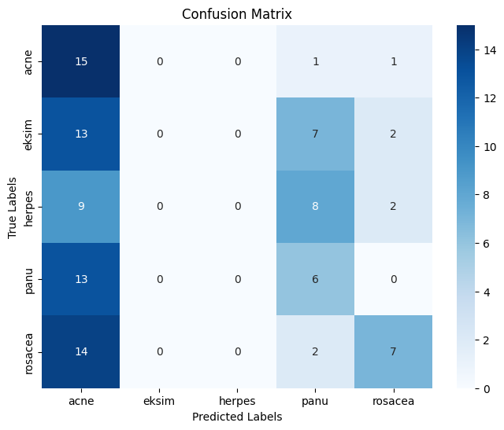
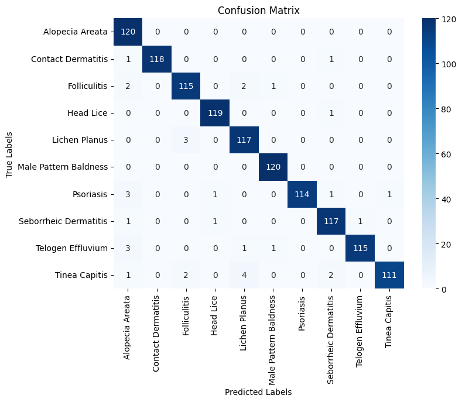
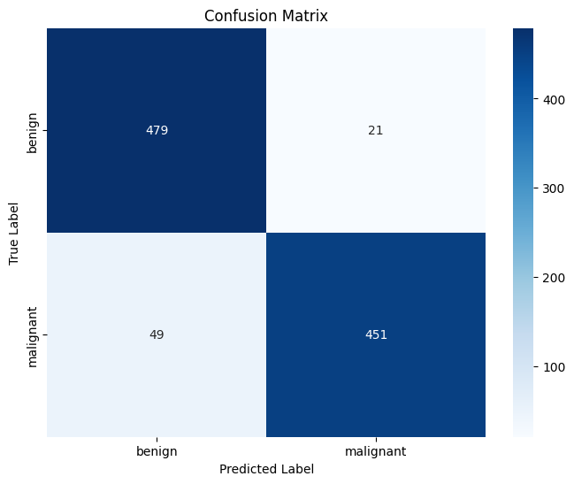
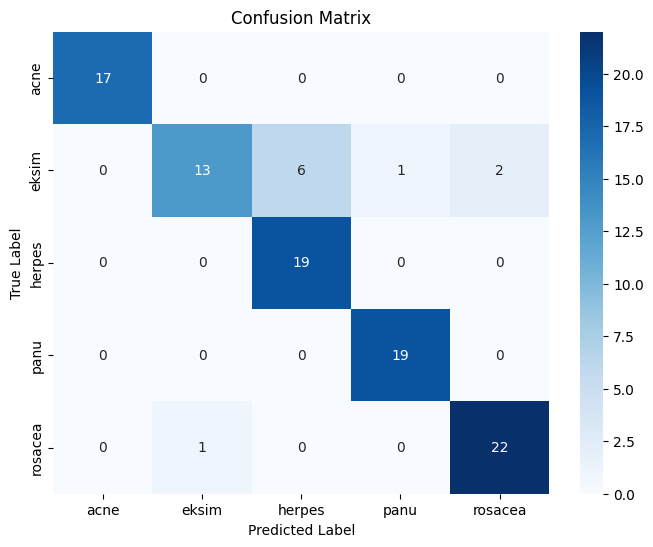
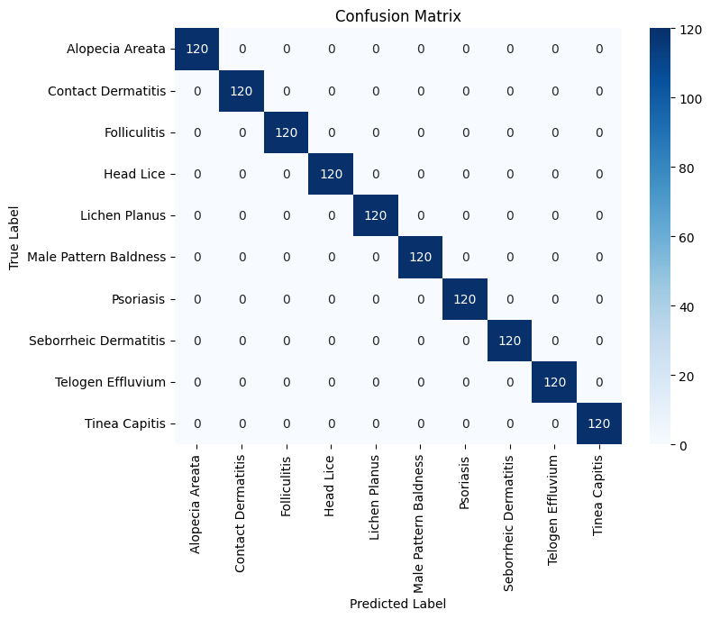

# ViT
Two ViT models tested on melanoma, facial skin diseases and hair diseases datasets.

To use from the scratch models, simply run

```python
from tensorflow.keras.models import load_model

# Load the model
loaded_model = load_model("path_to_saved_model") # for .keras models
```

To use pretrained models, run 

```python
model = ViTForImageClassification.from_pretrained('google/vit-base-patch16-224', num_labels=len(classes))
# len(classes) is equal to 2 for melanoma, 5 for facial skin diseases, 10 for hair diseases.

model.load_state_dict(torch.load('model.pth')) # for .pth models
model.eval()  # Set the model to evaluation mode
```
pretrained models are not available on github since they are bigger than 100mb. Please contact me if you want to use them.


## From the scratch models' results on different datasets

### Skin Cancer dataset (0.87 acc)


### Facial Skin Diseases dataset (0.28 acc)


### Hair Diseases dataset (0.97 acc)



## Pre-trained models' results on different datasets

### Skin Cancer dataset (0.93 acc)


### Facial Skin Diseases dataset (0.90 acc)


### Hair Diseases dataset (1.00 acc)



